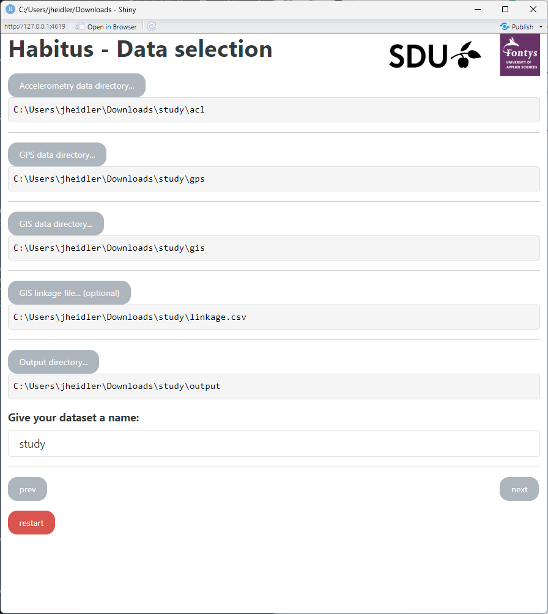

## 1. Introduction

The examples offer comprehensive guidance on processing data through the entire Habitus pipeline, resulting in obtaining spatiotemporal behaviour analysis. The results provide information on participants' behaviour based on geospatial data from GPS sensors ("where") and physical activity information ("what") from accelerometer sensors, along with additional details such as total wear and non-wear time for including/excluding participants.

When we use the term "where," we refer to the summarized information that shows the accumulated duration of "what" in specified domains:
total wear and non-wear;
total physical activity in intensity categories (light, moderate, vigorous);
total sedentary behaviour.
The researcher specifies these domains ("where's") as GIS (Geographic Information System) data information, including geometry polygons and paths for homes, neighbourhoods, schools, and other relevant locations. This means, for example, that we can obtain information about how much light activity a participant engages in at school, home, neighbourhood, or during transport. The exported results are always calculated as total values for each participant and their corresponding day.

## 2. Example data

The example is derived from the data collected through the ActiGraph accelerometer and GPS sensors manufactured by Qstarz. The accelerometer data is available in CSV format and measured in counts metric, exported by Actilife software. Similarly, GPS data is available in CSV format and exported by Qstarz's official software.

GIS data was prepared in QGIS and exported as shapefiles in the WGS84 CRS (Coordinate Reference System), the default format for GPS sensors.

The data provided are based on three participants who attend the same school but live in different neighbourhoods. Here is the link to download the [sample data](../assets/example.zip).

*[different neighbourhoods]: Two of the participants actually have the same home address.

## 3. Working directory

After downloading the example files and unzipping them, you are going to see a structure of directories as shown below ([Figure 1](#figure-1)). The "output" folder will contain processed files. Other files follow the structure of the example data.

<figure markdown="span" id="figure-1">
  { width="500" }
  <figcaption><strong>Figure 1</strong> Directory structure</figcaption>
</figure>

## 4. Install and launch HabitusGUI

Before processing, install necessary software and packages for HabitusGUI. Detailed installation information can be found [here](../gui/index.md).

``` r
install.packages("remotes")
remotes::install_github("habitus-eu/HabitusGUI", dependencies=TRUE)
install.packages("actilifecounts")
```

After installing HabitusGUI, execute the R code below to initialize the application. Remember to specify the correct directory. If HabitusGUI and the other necessary requirements were installed correctly, the HabitusGUI app will launch and a window with the application will appear.

``` r
library(HabitusGUI)
options("sp_evolution_status" = 2)
HabitusGUI::myApp(homedir="C:/study")
```

## 5. Selecting analysis type and required packages
 The user can then choose from several different types of analysis based on their input data. Since we will be processing data from accelerometer and GPS sensors to obtain the spatiotemporal behaviour of participants, we need to ensure that the following options are checked:

 - Acceleration (all formats accepted by GGIR)
 - GPS (in .csv format)
 - GIS (shape files + optionally linkage file)
 
 For this analysis, all packages must also be checked, which include GGIR, hbGPS, and hbGIS (as shown in [Figure 2](#figure-2)). Hit next! :slight_smile:


<figure markdown="span" id="figure-2">
  { width="500" }
  <figcaption><strong>Figure 2</strong> Selecting analysis type and required packages</figcaption>
</figure>

## 6. Data selection
The next step is to choose the relevant data for analysis, providing and matching multiple directories and files (refer to [Figure 3](#figure-3)).

#### Accelerometry and GPS data
The first files to be mapped are self-explanatory: data from sensors (accelerometer and GPS).

- Accelerometry - ActiGraph counts in CSV format.
- GPS - Qstarz (CRS: WSG84) in CSV format.

It's crucial to maintain consistency in file names. For example, a participant's accelerometry file should have the same name as their corresponding GPS file. Various methods exist for extracting IDs from files. For more details, refer to the [GGIR documentation](https://wadpac.github.io/GGIR/reference/GGIR.html).

#### GIS data and linkage file
Geometry files created with QGIS contain information about the locations of homes and schools, along with details about their neighbourhoods. These files must have a Coordinate Reference System (CRS) set and include information in the attribute table for matching participant IDs with the corresponding polygons. For each home and its neighbourhood, an attribute called "identifier" needs to be set for every polygon, and the same goes for schools (using the "school_id" attribute). After that, a linkage file matches participants' IDs with the corresponding polygons.

#### Output and dataset name
Finally, provide where the processed data should be saved and how to name the processed dataset.


<figure markdown="span" id="figure-3">
  { width="500" }
  <figcaption><strong>Figure 3</strong> Data selection</figcaption>
</figure>

## 7. Parameter configuration
The next step involves parameter configuration, specifically loading configuration files for the following processes:

1. GGIR – configuration for processing accelerometry data with GGIR.
2. hbGPS – parameters for processing GPS data and then combining it with accelerometry data processed from GGIR. It is essential to provide the correct date and time format and timezone and specify parameters for trip identification.
3. hbGIS – parameters and rules for GIS processing to obtain contextual information on participants' behaviour, focusing on "what" and "where".


<figure markdown="span" id="figure-4">
  { width="500" }
  <figcaption><strong>Figure 4</strong> Parameter configuration</figcaption>
</figure>

## 8. Analyses
Now is the time to perform the analysis. Execute each analysis in the specified order, and the results will be generated in the output file ([Figure 5](#figure-5)).

<figure markdown="span" id="figure-5">
  { width="500" }
  <figcaption><strong>Figure 5</strong> Analyses</figcaption>
</figure>

After the processing is completed without any errors, you will find the following directories and files in your output folder:

- **output_acl** – This contains processed data by GGIR.
- **hbGPSoutput** – Includes individual participant files and a combined file of all participants in a legacy PALMS format, combining accelerometry and GPS data with contextual information about trips.
- **hbGIS_output** – Contains files processed by hbGIS with contextual information about locations – what, where ([Figure 6](#figure-6)).

<figure markdown="span" id="figure-6">
  { width="500" }
  <figcaption><strong>Figure 6</strong> Proccessed (daily summaries)</figcaption>
</figure>