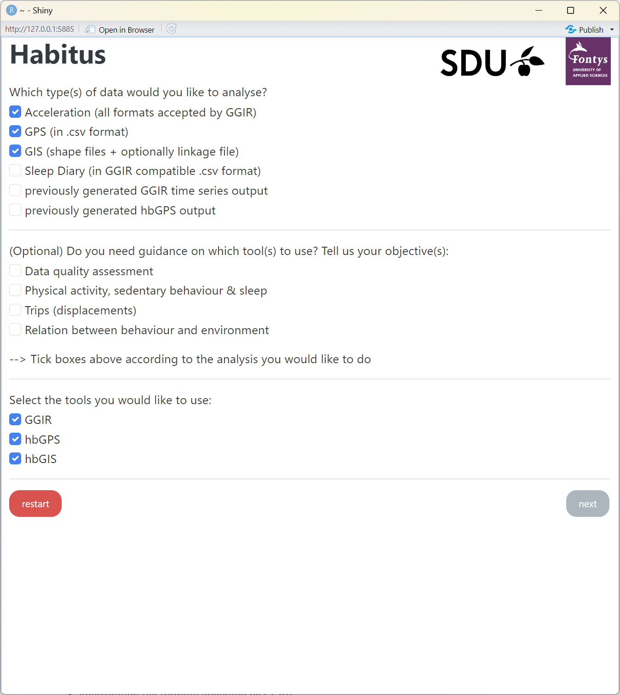

## 1. Introduction

The examples offer comprehensive guidance on processing data through the entire Habitus pipeline, resulting in obtaining spatiotemporal behaviour analysis. The results provide information on participants' behaviour based on geospatial data from GPS sensors ("where") and physical activity information ("what") from accelerometer sensors, along with additional details such as total wear and non-wear time for including/excluding participants.

When we use the term "where," we refer to the summarized information that shows the accumulated duration of "what" in specified domains:
total wear and non-wear;
total physical activity in intensity categories (light, moderate, vigorous);
total sedentary behaviour.
The researcher specifies these domains ("where's") as GIS (Geographic Information System) data information, including geometry polygons and paths for homes, neighbourhoods, schools, and other relevant locations. This means, for example, that we can obtain information about how much light activity a participant engages in at school, home, neighbourhood, or during transport. The {==[exported results](#)==} are always calculated as total values for each participant and their corresponding day.

## 2. Example data

The example is derived from the data collected through the ActiGraph accelerometer and GPS sensors manufactured by Qstarz. The accelerometer data is available in CSV format and measured in counts metric, exported by Actilife software. Similarly, GPS data is available in CSV format and exported by Qstarz's official software.

GIS data was prepared in QGIS and exported as shapefiles in the WGS84 CRS (Coordinate Reference System), the default format for GPS sensors. {==Additional information on how to prepare these files can be found below.==}

The data provided are based on three participants who attend the same school but live in different neighbourhoods. Here are the links to download the sample data:

*[different neighbourhoods]: Two of the participants actually have the same home address.

- [Accelerometer (Actigraph, counts, CSV)](../assets/acl.zip)
- [GPS (Qstarz, WSG84, CSV)](../assets/gps.zip)
- {==[GIS (QGIS, shapely + additional files)](#)==}
- [Linkage file (CSV)](../assets/linkage.csv)

## 3. Working directory

After downloading the example files, we recommend unzipping them and organizing them into a directory structure as shown below ([Figure 1](#figure-1)). Configuration files in "configs" folder will be downloaded and added later. The "output" folder will contain processed files. Other files follow the structure of the example data.

<figure markdown="span" id="figure-1">
  { width="500" }
  <figcaption><strong>Figure 1</strong> Directory structure</figcaption>
</figure>

## 4. Install and launch HabitusGUI

Before processing, install necessary software and packages for HabitusGUI. Detailed installation information can be found [here](../gui/index.md).

``` r
install.packages("remotes")
remotes::install_github("habitus-eu/HabitusGUI", dependencies=TRUE)
install.packages("actilifecounts")
```

After installing HabitusGUI, execute the R code below to initialize the application. Remember to specify the correct directory. If HabitusGUI and the other necessary requirements were installed correctly, the HabitusGUI app will launch and a window with the application will appear.

``` r
library(HabitusGUI)
options("sp_evolution_status" = 2)
HabitusGUI::myApp(homedir="C:/study")
```

## 5. Selecting analysis type and required packages
 The user can then choose from several different types of analysis based on their input data. Since we will be processing data from accelerometer and GPS sensors to obtain the spatiotemporal behaviour of participants, we need to ensure that the following options are checked:

 - Acceleration (all formats accepted by GGIR)
 - GPS (in .csv format)
 - GIS (shape files + optionally linkage file)
 
 For this analysis, all packages must also be checked, which include GGIR, hbGPS, and hbGIS (as shown in [Figure 2](#figure-2)). Hit next! :slight_smile:


<figure markdown="span" id="figure-2">
  { width="500" }
  <figcaption><strong>Figure 2</strong> Selecting analysis type and required packages</figcaption>
</figure>

## 6. Data selection