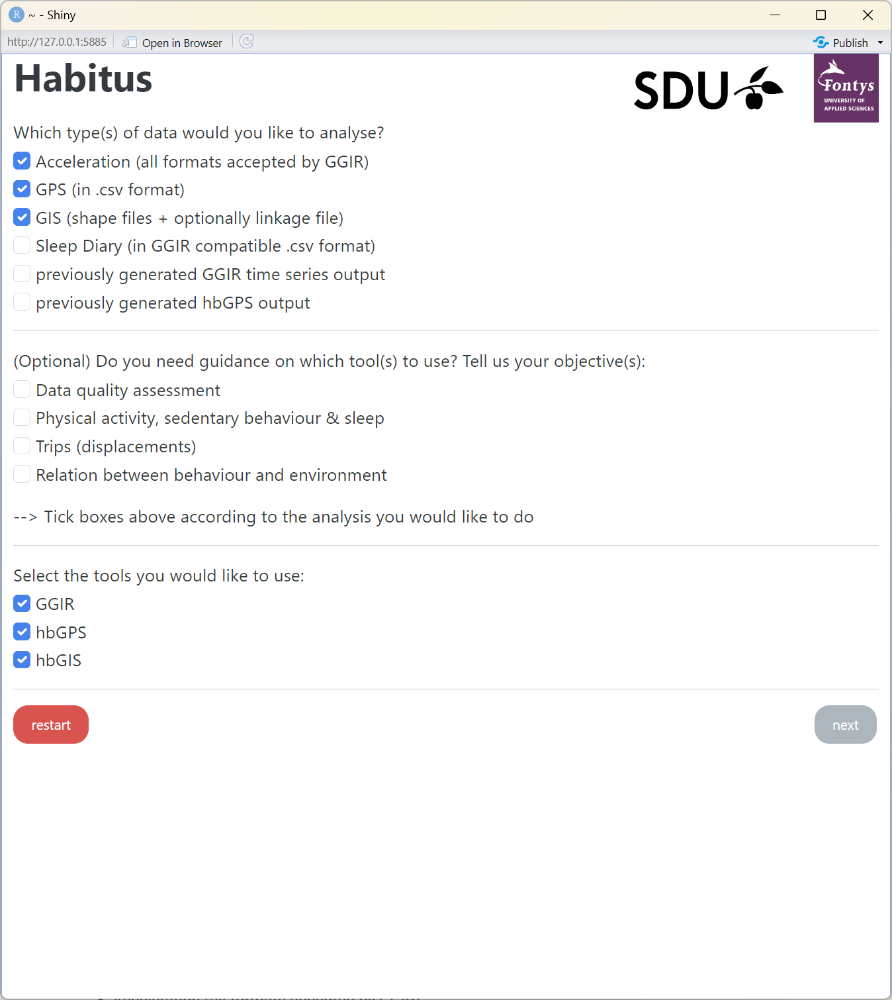

---
hide:
  - navigation
---

HabitusGUI simplifies movement behaviour data analysis by combining GGIR, hbGPS, and hbGIS in a user-friendly interface with several analysis options that perform the following:

1. Processing multi-day RAW accelerometer data for physical activity and sleep research (via [GGIR](https://cran.r-project.org/web/packages/GGIR/) package).
2. Analyzing spatiotemporal behaviour patterns using geospatial data (via [hbGPS](../gps/index.md), [hbGIS](../gis/index.md)).


## Installation

The [R language](https://cran.r-project.org/) must be installed as a prerequisite. We highly recommend using [RStudio](https://posit.co/downloads/), an IDE that simplifies working with R. The next step is to install the required R packages.

``` r
install.packages("remotes") # (1)!
remotes::install_github("habitus-eu/HabitusGUI", dependencies=TRUE) # (2)!

# Optional packages
install.packages(pkgs = c("actilifecounts", "ActCR", "GGIRread", "read.gt3x", "readxl")) # (3)!
```

1. R package for installation from remote repositories (Github).
2. Installing the actilifecounts package for processing accelerometer files in counts.
3. Install these packages to process accelerometer files in counts or use other GGIR functionalities.

!!! warning

    When installing packages, you may be prompted to update to more recent versions. We recommend updating all the packages.

## Usage

In order to launch the HabitusGUI application, the user needs to execute the following lines of code:

``` r
library(HabitusGUI)

options("sp_evolution_status" = 2) # (1)!
HabitusGUI::myApp(homedir="C:/path_to_project/folder") # (2)!
```

1. Ignore evolution warnings.
2. A directory that contains all necessary data in its root or subdirectories.

Upon launching the HabitusGUI application, the user will be prompted to select the desired analyses ([Figure 1](#figure-1)). For more information on how to use HabitusGUI, please refer to the provided [example](../examples/spatiotemporal_behaviour_analysis.md).

<figure markdown="span" id="figure-1">
  { width="500" }
  <figcaption><strong>Figure 1</strong> Selecting analysis type and required packages</figcaption>
</figure>

## Configuration files

Examples of configuration files to download include:

1. GGIR (data in [RAW format](../assets/configs/config_GGIR_raw.csv) or in [counts](../assets/configs/config_GGIR_counts.csv))
2. [hbGPS](../assets/configs/config_hbGPS.csv)
3. [hbGIS](../assets/configs/config_hbGIS.csv)