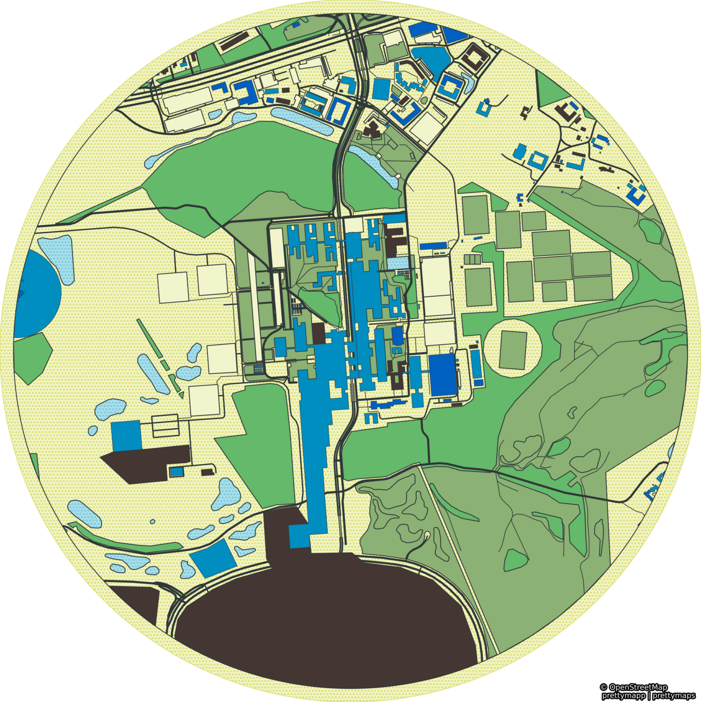

## What is HABITUS?

{ align=right width=400 }

Many people know *habitus* because of the French sociologist Pierre Bourdieu, who turned the concept into a cornerstone of his sociology. Bourdieu described that habitus refers to how individuals perceive the world around them and react to it, typically without thinking about their reaction. They react based on their previous experiences and preferences and what they perceive as socially appropriate behaviour in a particular social and spatial context.

HABITUS (Human Activity Behavior Identification Tool and Data Unification System) is much like Bourdieu's habitus, a tool for analysing people's behaviour in different contexts. HABITUS is a package written in R for processing physical activity behaviour data collected with wearable devices. Its primary function is to merge, and process time-stamped data from accelerometer and global positioning system (GPS) devices and provide output files dividing physical activity levels into different contexts or domains.

The importance of dividing physical activity into domains was recognised many years ago. However, for device-based measures, including contextual information is rare, and the expert group that developed the [2020 WHO guidelines](https://www.who.int/publications/i/item/9789240015128) identified a need for more information on domains of physical activity as one of the significant [evidence gaps that need to be addressed](https://ijbnpa.biomedcentral.com/articles/10.1186/s12966-020-01042-2) in future studies. Combining device-based physical activity measures with contextual information is more complex in practice. One of the reasons is that the use of GPS devices to provide contextual information is not yet widespread, and the use of two devices generates much larger volume of data, and combining and processing this data is more complex.

## What does HABITUS do?

HABITUS merges and processes time-stamped data from accelerometer and global positioning system (GPS) devices and provides output files dividing physical activity levels into different contexts or domains. In short, it makes processing accelerometer and GPS data easier.

## HABITUS builds on existing software tools

We have not tried to reinvent the wheel in creating HABITUS but instead tried to save time and build on what other researchers have already created. HABITUS builds on existing software tools: [PALMSpy](https://github.com/emolinaro/PALMSpy), [GGIR](https://cran.r-project.org/web/packages/GGIR/vignettes/GGIR.html) and [PALMSplus](https://thets.github.io/palmsplusr/).
The core functionality for merging and processing accelerometer and GPS data used in HABITUS has its background in PALMS (Personal Activity Location Measurement System), which became available in 2008. PALMS was developed by the Center for Wireless and Population Health System at the University of California, San Diego and has been serving many GPS researchers worldwide until 2018. All PALMS experiences and algorithms were carried over to HABITUS, securing backward compatibility. However, new functionality was added, e.g., raw accelerometer data processing using the GGIR accelerometer data processing package.

## HABITUS consists of three separate elements

TO-DO...

## Development

As with any open-source software, HABITUS is a work in progress. We will keep developing it for our projects and needs, and we are always keen to collaborate with others, integrate new functionality, and improve existing functions.